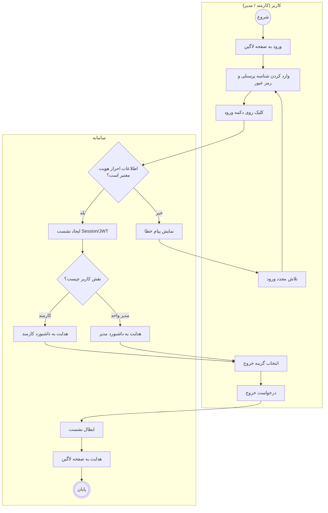

```mermaid
flowchart TD
    subgraph User ["کاربر (کارمند / مدیر)"]
        direction TB
        Start((شروع)) --> A[ورود به صفحه لاگین]
        A --> B[وارد کردن شناسه پرسنلی و رمز عبور]
        B --> C[کلیک روی دکمه ورود]
        
        C_Retry[تلاش مجدد ورود] --> B
        
        Logout[انتخاب گزینه خروج] --> Logout_Action[درخواست خروج]
    end

    subgraph System ["سامانه"]
        direction TB
        D{اطلاعات احراز هویت<br>معتبر است؟}
        E[نمایش پیام خطا]
        
        F[ایجاد نشست Session/JWT]
        G{نقش کاربر چیست؟}
        
        H[هدایت به داشبورد کارمند]
        I[هدایت به داشبورد مدیر]
        
        J[ابطال نشست]
        K[هدایت به صفحه لاگین]
        
        End(((پایان)))
    end

    %% ارتباط بین کاربر و سامانه
    C --> D
    D -->|خیر| E
    E --> C_Retry
    
    D -->|بله| F
    F --> G
    
    G -->|کارمند| H
    G -->|مدیر واحد| I
    
    H --> Logout
    I --> Logout
    
    Logout_Action --> J
    J --> K
    K --> End
```
