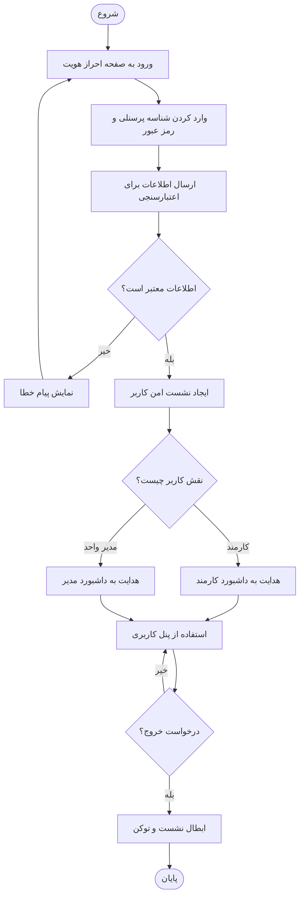

```mermaid
flowchart TD
    A([شروع]) --> B[ورود به صفحه احراز هویت]
    B --> C[وارد کردن شناسه پرسنلی و رمز عبور]
    C --> D[ارسال اطلاعات برای اعتبارسنجی]
    D --> E{اطلاعات معتبر است؟}

    E -- خیر --> F[نمایش پیام خطا]
    F --> B

    E -- بله --> G[ایجاد نشست امن کاربر]
    G --> H{نقش کاربر چیست؟}

    H -- کارمند --> I[هدایت به داشبورد کارمند]
    H -- مدیر واحد --> J[هدایت به داشبورد مدیر]

    I --> K[استفاده از پنل کاربری]
    J --> K

    K --> L{درخواست خروج؟}
    L -- خیر --> K
    L -- بله --> M[ابطال نشست و توکن]
    M --> N([پایان])
```
