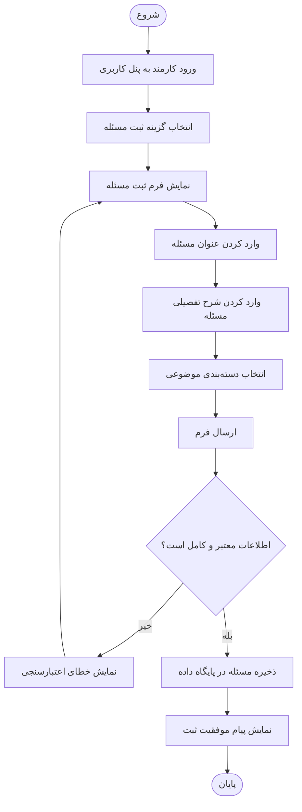

```mermaid
flowchart TD
    A([شروع]) --> B[ورود کارمند به پنل کاربری]
    B --> C[انتخاب گزینه ثبت مسئله]
    C --> D[نمایش فرم ثبت مسئله]
    D --> E[وارد کردن عنوان مسئله]
    E --> F[وارد کردن شرح تفصیلی مسئله]
    F --> G[انتخاب دسته‌بندی موضوعی]
    G --> H[ارسال فرم]
    H --> I{اطلاعات معتبر و کامل است؟}

    I -- خیر --> J[نمایش خطای اعتبارسنجی]
    J --> D

    I -- بله --> K[ذخیره مسئله در پایگاه داده]
    K --> L[نمایش پیام موفقیت ثبت]
    L --> M([پایان])
```
