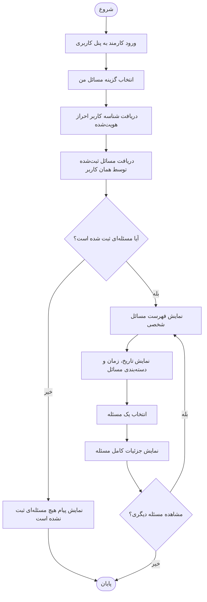

```mermaid
flowchart TD
    A([شروع]) --> B[ورود کارمند به پنل کاربری]
    B --> C[انتخاب گزینه مسائل من]
    C --> D[دریافت شناسه کاربر احراز هویت‌شده]
    D --> E[دریافت مسائل ثبت‌شده توسط همان کاربر]
    E --> F{آیا مسئله‌ای ثبت شده است؟}

    F -- خیر --> G[نمایش پیام هیچ مسئله‌ای ثبت نشده است]
    G --> H([پایان])

    F -- بله --> I[نمایش فهرست مسائل شخصی]
    I --> J[نمایش تاریخ، زمان و دسته‌بندی مسائل]
    J --> K[انتخاب یک مسئله]
    K --> L[نمایش جزئیات کامل مسئله]
    L --> M{مشاهده مسئله دیگری؟}

    M -- بله --> I
    M -- خیر --> H
```
