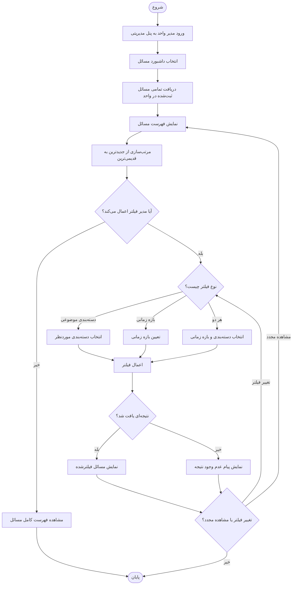

```mermaid
flowchart TD
    A([شروع]) --> B[ورود مدیر واحد به پنل مدیریتی]
    B --> C[انتخاب داشبورد مسائل]
    C --> D[دریافت تمامی مسائل ثبت‌شده در واحد]
    D --> E[نمایش فهرست مسائل]
    E --> F[مرتب‌سازی از جدیدترین به قدیمی‌ترین]
    F --> G{آیا مدیر فیلتر اعمال می‌کند؟}

    G -- خیر --> H[مشاهده فهرست کامل مسائل]
    G -- بله --> I{نوع فیلتر چیست؟}

    I -- دسته‌بندی موضوعی --> J[انتخاب دسته‌بندی موردنظر]
    I -- بازه زمانی --> K[تعیین بازه زمانی]
    I -- هر دو --> L[انتخاب دسته‌بندی و بازه زمانی]

    J --> M[اعمال فیلتر]
    K --> M
    L --> M

    M --> N{نتیجه‌ای یافت شد؟}

    N -- بله --> O[نمایش مسائل فیلترشده]
    N -- خیر --> P[نمایش پیام عدم وجود نتیجه]

    O --> Q{تغییر فیلتر یا مشاهده مجدد؟}
    P --> Q

    Q -- تغییر فیلتر --> I
    Q -- مشاهده مجدد --> E
    H --> R([پایان])
    Q -- خیر --> R
```
