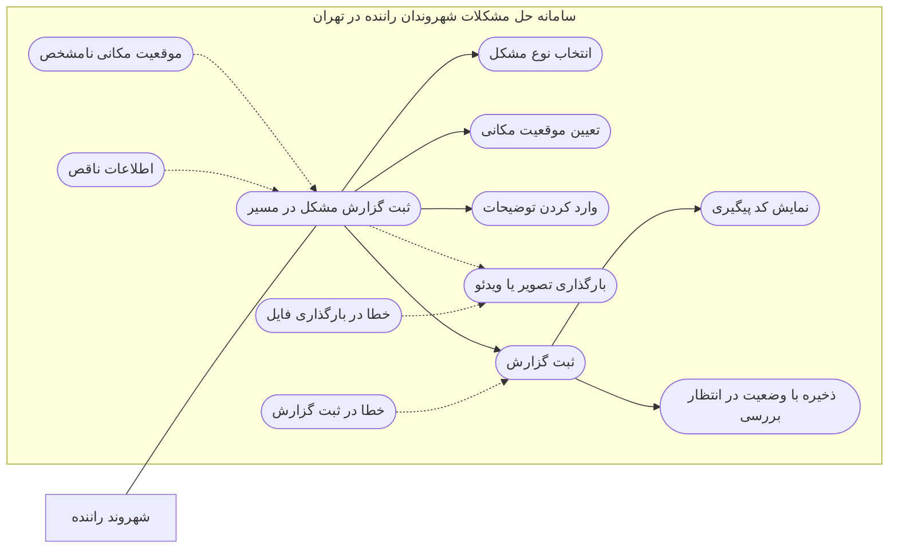

# UC-02: ثبت گزارش مشکل در مسیر

```mermaid
flowchart LR
    A["شهروند راننده"]

    subgraph S["سامانه حل مشکلات شهروندان راننده در تهران"]
        B(["ثبت گزارش مشکل در مسیر"])
        C(["انتخاب نوع مشکل"])
        D(["تعیین موقعیت مکانی"])
        E(["وارد کردن توضیحات"])
        F(["بارگذاری تصویر یا ویدئو"])
        G(["ثبت گزارش"])
        H(["نمایش کد پیگیری"])
        I(["ذخیره با وضعیت در انتظار بررسی"])
        J(["موقعیت مکانی نامشخص"])
        K(["اطلاعات ناقص"])
        L(["خطا در بارگذاری فایل"])
        M(["خطا در ثبت گزارش"])

        B --> C
        B --> D
        B --> E
        B -.-> F
        B --> G
        G --> H
        G --> I
        J -.-> B
        K -.-> B
        L -.-> F
        M -.-> G
    end

    A --- B
```
